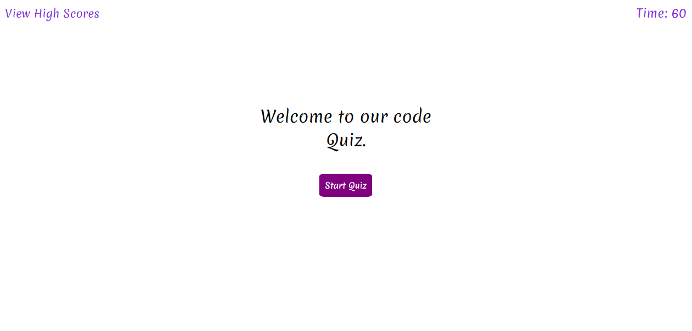
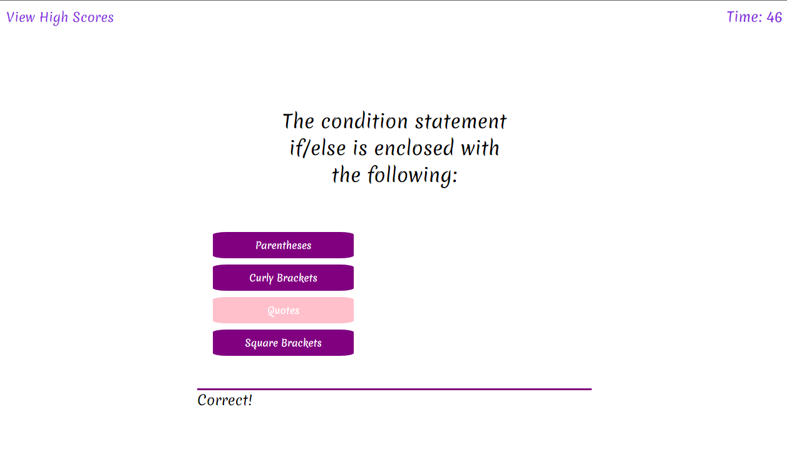
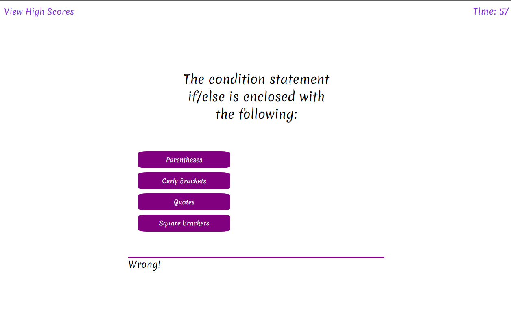
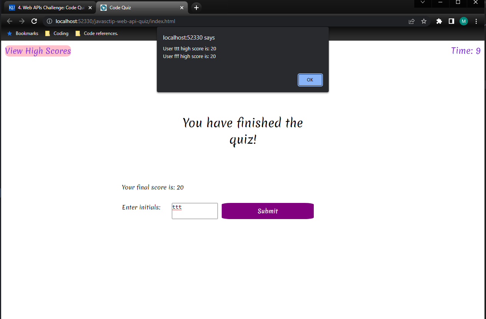
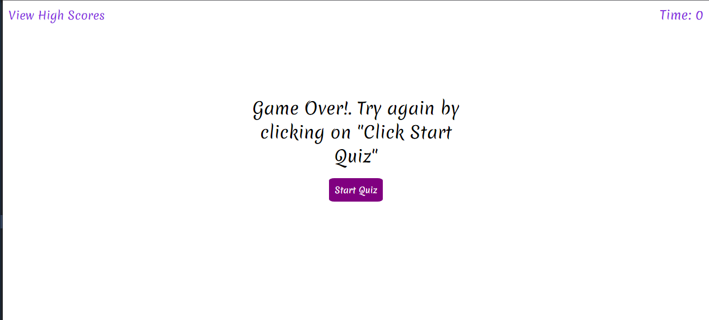

## Web APIs Challenge: Code Quiz

1. [ Description. ](#desc)
2. [ Web Address. ](#web-address)
3. [ Usage tips. ](#usage)
4. [ Contributing. ](#contributing)
5. [ License. ](#license)


<a name="desc"></a>
## 1. Description


### This is a Code quiz using CSS, Javascript Dynamic and non dynamic elements and a countdown application.

This code was created fully inside a timer, which is not necessary the best option but it was fun to get it to fully work that way.


Desktop screen:



Smaller devices screen:


<a name="web-address"></a>
## 2. How to Get There

### Open your favorite web browser and enter the following web address to access.

```html
https://matthewgrisham.github.io/web-api-challenge-code-quiz/
```
<a name="usage"></a>
## 3. Usage Tips


### Follow the criteria instructions to finish the quiz

Steps to navidate the quiz.


### Click Start Quiz


### Quiz has started along with a 60 seconds countdown



### Answer each question to get to the next question. There are 5 questions in total.
#### You can either get a correct or incorrect answer.




### There are two end quiz situations: Either the user finishes the quiz or the timer ends at 0.
#### If the user finishes all the qustions, the user will be able to enter their initials to save the score.
#### If the user does not end the quiz on time, the user will need to start the quiz again from the beggining.






### End quiz details
#### If new user initial, the user will be able to enter their score.
#### If user tries to enter score again with same inititials, alert will show with proper response.
#### If user takes quiz again and gets a better score, the system will allow it.
#### If user takes quiz and does worse, the system will not log the lower score.


<a name="contributing"></a>
## 4. Contributing
Pull requests are welcome. For major changes, please open let repository owner know to discuss what would you like to change.

<a name="license"></a>
## 5. License
None